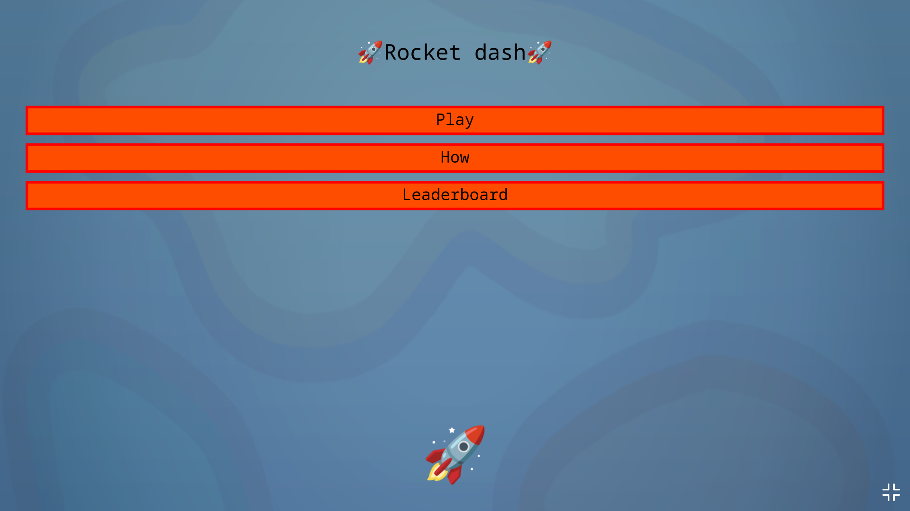

# Rocket dash
Simple dodge game I made when I was 12. 

## How to play
1. Use your mouse to move the rocket, dodge the asteroids. 
2. Try to get the highest score. 
3. Have fun!

## Compatibility
The game runs on all devices, including **mobile phones and tablets**. The preferred screen orientation is portrait, but it will work fine with any orientation as long as the canvas **width >= 400** and **height >= 600**. 

## Credits
- **Khan Academy** - space background image
- **q5js.org** - Q5.js library and example code
- **ChatGPT** - fullscreen status check

## Screenshot

